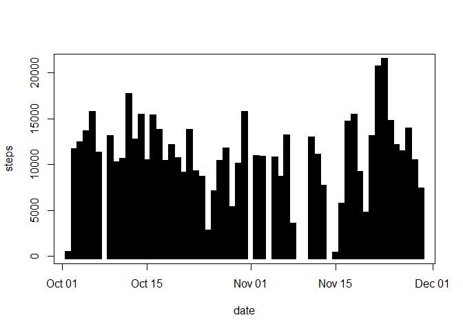
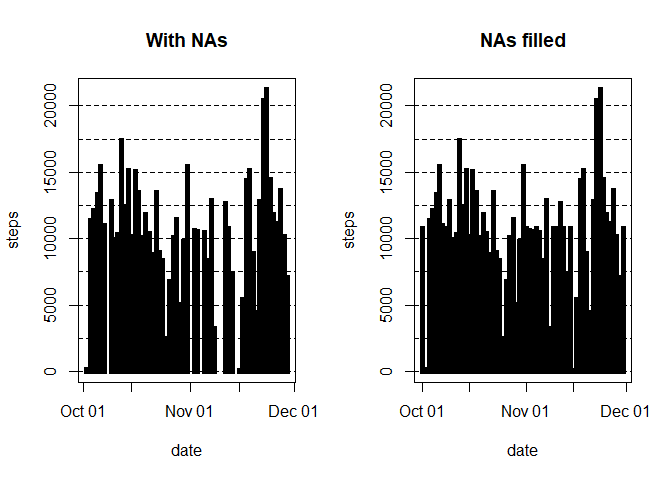
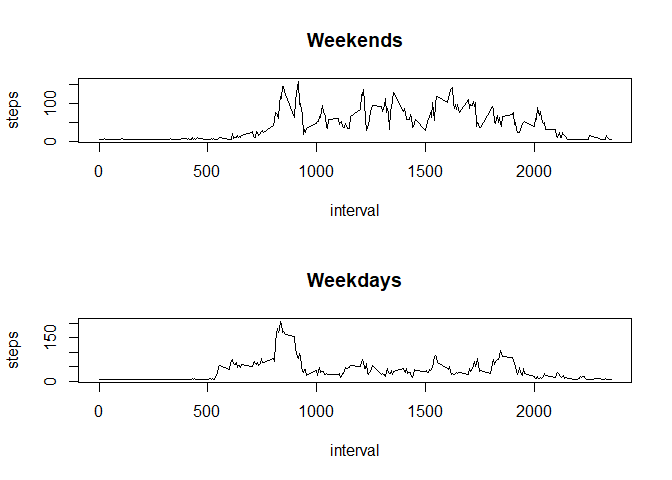

title: 'Reproducible Research: Peer Assessment 1'
output:
  html_document:
    fig_caption: 
    keep_md: yes
  pdf_document: default
  word_document: default
---


```r
## Loading and preprocessing the data

# Downloaded the dataset in activity.zip file and then reading it in csv format and loading it into 'activity' and checking the class

activity <- read.csv(unz("activity.zip", "activity.csv"))

sapply(activity, class)
```

```
##     steps      date  interval 
## "integer"  "factor" "integer"
```

```r
# Process/transform the data (if necessary) into a format suitable for your analysis
# Converting activity date to date class from factor

activity$date <- as.Date(activity$date, format = "%Y-%m-%d")

# Installing the zoo package

#install.packages("zoo", repos="http://R-Forge.R-project.org")

#suppressWarnings(library(zoo))

# Checking whether activity$date is strictly regular and checking the unique activitiy dates

#is.regular(activity$date,strict = TRUE)

#unique(activity$date)

## What is mean total number of steps taken per day?

# Calculate the total number of steps taken per day

steps_day <- aggregate(steps ~ date, rm.na = TRUE, data = activity, FUN = sum)

# Checking the values stored in steps_day

steps_day
```

```
##          date steps
## 1  2012-10-02   127
## 2  2012-10-03 11353
## 3  2012-10-04 12117
## 4  2012-10-05 13295
## 5  2012-10-06 15421
## 6  2012-10-07 11016
## 7  2012-10-09 12812
## 8  2012-10-10  9901
## 9  2012-10-11 10305
## 10 2012-10-12 17383
## 11 2012-10-13 12427
## 12 2012-10-14 15099
## 13 2012-10-15 10140
## 14 2012-10-16 15085
## 15 2012-10-17 13453
## 16 2012-10-18 10057
## 17 2012-10-19 11830
## 18 2012-10-20 10396
## 19 2012-10-21  8822
## 20 2012-10-22 13461
## 21 2012-10-23  8919
## 22 2012-10-24  8356
## 23 2012-10-25  2493
## 24 2012-10-26  6779
## 25 2012-10-27 10120
## 26 2012-10-28 11459
## 27 2012-10-29  5019
## 28 2012-10-30  9820
## 29 2012-10-31 15415
## 30 2012-11-02 10601
## 31 2012-11-03 10572
## 32 2012-11-05 10440
## 33 2012-11-06  8335
## 34 2012-11-07 12884
## 35 2012-11-08  3220
## 36 2012-11-11 12609
## 37 2012-11-12 10766
## 38 2012-11-13  7337
## 39 2012-11-15    42
## 40 2012-11-16  5442
## 41 2012-11-17 14340
## 42 2012-11-18 15111
## 43 2012-11-19  8842
## 44 2012-11-20  4473
## 45 2012-11-21 12788
## 46 2012-11-22 20428
## 47 2012-11-23 21195
## 48 2012-11-24 14479
## 49 2012-11-25 11835
## 50 2012-11-26 11163
## 51 2012-11-27 13647
## 52 2012-11-28 10184
## 53 2012-11-29  7048
```

```r
# Make a histogram of the total number of steps taken each day

plot(steps_day, type = "h", lwd = 10, lend = "square")
```

<!-- -->

```r
# Calculate and report the mean and median of the total number of steps taken per day

aggregate(steps ~ date, data = activity, FUN = mean)
```

```
##          date      steps
## 1  2012-10-02  0.4375000
## 2  2012-10-03 39.4166667
## 3  2012-10-04 42.0694444
## 4  2012-10-05 46.1597222
## 5  2012-10-06 53.5416667
## 6  2012-10-07 38.2465278
## 7  2012-10-09 44.4826389
## 8  2012-10-10 34.3750000
## 9  2012-10-11 35.7777778
## 10 2012-10-12 60.3541667
## 11 2012-10-13 43.1458333
## 12 2012-10-14 52.4236111
## 13 2012-10-15 35.2048611
## 14 2012-10-16 52.3750000
## 15 2012-10-17 46.7083333
## 16 2012-10-18 34.9166667
## 17 2012-10-19 41.0729167
## 18 2012-10-20 36.0937500
## 19 2012-10-21 30.6284722
## 20 2012-10-22 46.7361111
## 21 2012-10-23 30.9652778
## 22 2012-10-24 29.0104167
## 23 2012-10-25  8.6527778
## 24 2012-10-26 23.5347222
## 25 2012-10-27 35.1354167
## 26 2012-10-28 39.7847222
## 27 2012-10-29 17.4236111
## 28 2012-10-30 34.0937500
## 29 2012-10-31 53.5208333
## 30 2012-11-02 36.8055556
## 31 2012-11-03 36.7048611
## 32 2012-11-05 36.2465278
## 33 2012-11-06 28.9375000
## 34 2012-11-07 44.7326389
## 35 2012-11-08 11.1770833
## 36 2012-11-11 43.7777778
## 37 2012-11-12 37.3784722
## 38 2012-11-13 25.4722222
## 39 2012-11-15  0.1423611
## 40 2012-11-16 18.8923611
## 41 2012-11-17 49.7881944
## 42 2012-11-18 52.4652778
## 43 2012-11-19 30.6979167
## 44 2012-11-20 15.5277778
## 45 2012-11-21 44.3993056
## 46 2012-11-22 70.9270833
## 47 2012-11-23 73.5902778
## 48 2012-11-24 50.2708333
## 49 2012-11-25 41.0902778
## 50 2012-11-26 38.7569444
## 51 2012-11-27 47.3819444
## 52 2012-11-28 35.3576389
## 53 2012-11-29 24.4687500
```

```r
aggregate(steps ~ date, data = activity, FUN = median)
```

```
##          date steps
## 1  2012-10-02     0
## 2  2012-10-03     0
## 3  2012-10-04     0
## 4  2012-10-05     0
## 5  2012-10-06     0
## 6  2012-10-07     0
## 7  2012-10-09     0
## 8  2012-10-10     0
## 9  2012-10-11     0
## 10 2012-10-12     0
## 11 2012-10-13     0
## 12 2012-10-14     0
## 13 2012-10-15     0
## 14 2012-10-16     0
## 15 2012-10-17     0
## 16 2012-10-18     0
## 17 2012-10-19     0
## 18 2012-10-20     0
## 19 2012-10-21     0
## 20 2012-10-22     0
## 21 2012-10-23     0
## 22 2012-10-24     0
## 23 2012-10-25     0
## 24 2012-10-26     0
## 25 2012-10-27     0
## 26 2012-10-28     0
## 27 2012-10-29     0
## 28 2012-10-30     0
## 29 2012-10-31     0
## 30 2012-11-02     0
## 31 2012-11-03     0
## 32 2012-11-05     0
## 33 2012-11-06     0
## 34 2012-11-07     0
## 35 2012-11-08     0
## 36 2012-11-11     0
## 37 2012-11-12     0
## 38 2012-11-13     0
## 39 2012-11-15     0
## 40 2012-11-16     0
## 41 2012-11-17     0
## 42 2012-11-18     0
## 43 2012-11-19     0
## 44 2012-11-20     0
## 45 2012-11-21     0
## 46 2012-11-22     0
## 47 2012-11-23     0
## 48 2012-11-24     0
## 49 2012-11-25     0
## 50 2012-11-26     0
## 51 2012-11-27     0
## 52 2012-11-28     0
## 53 2012-11-29     0
```

```r
## What is the average daily activity pattern?

# Make a time series plot (i.e. type = "l") of the 5-minute interval (x-axis) and the average number of steps taken, averaged across all days (y-axis)

plot(aggregate(steps ~ interval, data = activity, FUN = mean), type = "l")
```

<!-- -->

```r
# Which 5-minute interval, on average across all the days in the dataset, contains the maximum number of steps?

max(activity$steps, na.rm = TRUE)
```

```
## [1] 806
```

```r
## Imputing missing values
# Calculate and report the total number of missing values in the dataset (i.e. the total number of rows with NAs)

sum(is.na(activity))
```

```
## [1] 2304
```

```r
# Devise a strategy for filling in all of the missing values in the dataset. The strategy does not need to be sophisticated. For example, you could use the mean/median for that day, or the mean for that 5-minute interval, etc.

# The missing values can be substituted in such a way so that the Mean and Median is not affected by the substituted value.A nice way to do that is to make the substitution same as overall Mean.

# Create a new dataset that is equal to the original dataset but with the missing data filled in.

activity2 <- activity 

sapply(activity2, class)
```

```
##     steps      date  interval 
## "integer"    "Date" "integer"
```

```r
activity2$steps[is.na(activity2$steps)] <- mean(na.omit(activity$steps))

activity2$date <- as.Date(activity2$date, format = "%Y-%m-%d")

# Make a histogram of the total number of steps taken each day and Calculate and report the mean and median total number of steps taken per day. Do these values differ from the estimates from the first part of the assignment? What is the impact of imputing missing data on the estimates of the total daily number of steps?

steps_day2 <- aggregate(steps ~ date, rm.na = TRUE, data = activity2, FUN = sum)

par(mfrow = c(1, 2))

plot(steps_day, type = "h", lwd = 5,lend = "square", main = "With NAs")

abline(h = seq(0, 20000, 2500), lty = "dashed")

plot(steps_day2, type = "h", lwd = 5, lend = "square", main = "NAs filled")

abline(h = seq(0, 20000, 2500), lty = "dashed")
```

<!-- -->

```r
aggregate(steps ~ date, data = activity, FUN = mean)
```

```
##          date      steps
## 1  2012-10-02  0.4375000
## 2  2012-10-03 39.4166667
## 3  2012-10-04 42.0694444
## 4  2012-10-05 46.1597222
## 5  2012-10-06 53.5416667
## 6  2012-10-07 38.2465278
## 7  2012-10-09 44.4826389
## 8  2012-10-10 34.3750000
## 9  2012-10-11 35.7777778
## 10 2012-10-12 60.3541667
## 11 2012-10-13 43.1458333
## 12 2012-10-14 52.4236111
## 13 2012-10-15 35.2048611
## 14 2012-10-16 52.3750000
## 15 2012-10-17 46.7083333
## 16 2012-10-18 34.9166667
## 17 2012-10-19 41.0729167
## 18 2012-10-20 36.0937500
## 19 2012-10-21 30.6284722
## 20 2012-10-22 46.7361111
## 21 2012-10-23 30.9652778
## 22 2012-10-24 29.0104167
## 23 2012-10-25  8.6527778
## 24 2012-10-26 23.5347222
## 25 2012-10-27 35.1354167
## 26 2012-10-28 39.7847222
## 27 2012-10-29 17.4236111
## 28 2012-10-30 34.0937500
## 29 2012-10-31 53.5208333
## 30 2012-11-02 36.8055556
## 31 2012-11-03 36.7048611
## 32 2012-11-05 36.2465278
## 33 2012-11-06 28.9375000
## 34 2012-11-07 44.7326389
## 35 2012-11-08 11.1770833
## 36 2012-11-11 43.7777778
## 37 2012-11-12 37.3784722
## 38 2012-11-13 25.4722222
## 39 2012-11-15  0.1423611
## 40 2012-11-16 18.8923611
## 41 2012-11-17 49.7881944
## 42 2012-11-18 52.4652778
## 43 2012-11-19 30.6979167
## 44 2012-11-20 15.5277778
## 45 2012-11-21 44.3993056
## 46 2012-11-22 70.9270833
## 47 2012-11-23 73.5902778
## 48 2012-11-24 50.2708333
## 49 2012-11-25 41.0902778
## 50 2012-11-26 38.7569444
## 51 2012-11-27 47.3819444
## 52 2012-11-28 35.3576389
## 53 2012-11-29 24.4687500
```

```r
aggregate(steps ~ date, data = activity, FUN = median)
```

```
##          date steps
## 1  2012-10-02     0
## 2  2012-10-03     0
## 3  2012-10-04     0
## 4  2012-10-05     0
## 5  2012-10-06     0
## 6  2012-10-07     0
## 7  2012-10-09     0
## 8  2012-10-10     0
## 9  2012-10-11     0
## 10 2012-10-12     0
## 11 2012-10-13     0
## 12 2012-10-14     0
## 13 2012-10-15     0
## 14 2012-10-16     0
## 15 2012-10-17     0
## 16 2012-10-18     0
## 17 2012-10-19     0
## 18 2012-10-20     0
## 19 2012-10-21     0
## 20 2012-10-22     0
## 21 2012-10-23     0
## 22 2012-10-24     0
## 23 2012-10-25     0
## 24 2012-10-26     0
## 25 2012-10-27     0
## 26 2012-10-28     0
## 27 2012-10-29     0
## 28 2012-10-30     0
## 29 2012-10-31     0
## 30 2012-11-02     0
## 31 2012-11-03     0
## 32 2012-11-05     0
## 33 2012-11-06     0
## 34 2012-11-07     0
## 35 2012-11-08     0
## 36 2012-11-11     0
## 37 2012-11-12     0
## 38 2012-11-13     0
## 39 2012-11-15     0
## 40 2012-11-16     0
## 41 2012-11-17     0
## 42 2012-11-18     0
## 43 2012-11-19     0
## 44 2012-11-20     0
## 45 2012-11-21     0
## 46 2012-11-22     0
## 47 2012-11-23     0
## 48 2012-11-24     0
## 49 2012-11-25     0
## 50 2012-11-26     0
## 51 2012-11-27     0
## 52 2012-11-28     0
## 53 2012-11-29     0
```

```r
aggregate(steps ~ date, data = activity2, FUN = mean)
```

```
##          date      steps
## 1  2012-10-01 37.3825996
## 2  2012-10-02  0.4375000
## 3  2012-10-03 39.4166667
## 4  2012-10-04 42.0694444
## 5  2012-10-05 46.1597222
## 6  2012-10-06 53.5416667
## 7  2012-10-07 38.2465278
## 8  2012-10-08 37.3825996
## 9  2012-10-09 44.4826389
## 10 2012-10-10 34.3750000
## 11 2012-10-11 35.7777778
## 12 2012-10-12 60.3541667
## 13 2012-10-13 43.1458333
## 14 2012-10-14 52.4236111
## 15 2012-10-15 35.2048611
## 16 2012-10-16 52.3750000
## 17 2012-10-17 46.7083333
## 18 2012-10-18 34.9166667
## 19 2012-10-19 41.0729167
## 20 2012-10-20 36.0937500
## 21 2012-10-21 30.6284722
## 22 2012-10-22 46.7361111
## 23 2012-10-23 30.9652778
## 24 2012-10-24 29.0104167
## 25 2012-10-25  8.6527778
## 26 2012-10-26 23.5347222
## 27 2012-10-27 35.1354167
## 28 2012-10-28 39.7847222
## 29 2012-10-29 17.4236111
## 30 2012-10-30 34.0937500
## 31 2012-10-31 53.5208333
## 32 2012-11-01 37.3825996
## 33 2012-11-02 36.8055556
## 34 2012-11-03 36.7048611
## 35 2012-11-04 37.3825996
## 36 2012-11-05 36.2465278
## 37 2012-11-06 28.9375000
## 38 2012-11-07 44.7326389
## 39 2012-11-08 11.1770833
## 40 2012-11-09 37.3825996
## 41 2012-11-10 37.3825996
## 42 2012-11-11 43.7777778
## 43 2012-11-12 37.3784722
## 44 2012-11-13 25.4722222
## 45 2012-11-14 37.3825996
## 46 2012-11-15  0.1423611
## 47 2012-11-16 18.8923611
## 48 2012-11-17 49.7881944
## 49 2012-11-18 52.4652778
## 50 2012-11-19 30.6979167
## 51 2012-11-20 15.5277778
## 52 2012-11-21 44.3993056
## 53 2012-11-22 70.9270833
## 54 2012-11-23 73.5902778
## 55 2012-11-24 50.2708333
## 56 2012-11-25 41.0902778
## 57 2012-11-26 38.7569444
## 58 2012-11-27 47.3819444
## 59 2012-11-28 35.3576389
## 60 2012-11-29 24.4687500
## 61 2012-11-30 37.3825996
```

```r
aggregate(steps ~ date, data = activity2, FUN = median)
```

```
##          date   steps
## 1  2012-10-01 37.3826
## 2  2012-10-02  0.0000
## 3  2012-10-03  0.0000
## 4  2012-10-04  0.0000
## 5  2012-10-05  0.0000
## 6  2012-10-06  0.0000
## 7  2012-10-07  0.0000
## 8  2012-10-08 37.3826
## 9  2012-10-09  0.0000
## 10 2012-10-10  0.0000
## 11 2012-10-11  0.0000
## 12 2012-10-12  0.0000
## 13 2012-10-13  0.0000
## 14 2012-10-14  0.0000
## 15 2012-10-15  0.0000
## 16 2012-10-16  0.0000
## 17 2012-10-17  0.0000
## 18 2012-10-18  0.0000
## 19 2012-10-19  0.0000
## 20 2012-10-20  0.0000
## 21 2012-10-21  0.0000
## 22 2012-10-22  0.0000
## 23 2012-10-23  0.0000
## 24 2012-10-24  0.0000
## 25 2012-10-25  0.0000
## 26 2012-10-26  0.0000
## 27 2012-10-27  0.0000
## 28 2012-10-28  0.0000
## 29 2012-10-29  0.0000
## 30 2012-10-30  0.0000
## 31 2012-10-31  0.0000
## 32 2012-11-01 37.3826
## 33 2012-11-02  0.0000
## 34 2012-11-03  0.0000
## 35 2012-11-04 37.3826
## 36 2012-11-05  0.0000
## 37 2012-11-06  0.0000
## 38 2012-11-07  0.0000
## 39 2012-11-08  0.0000
## 40 2012-11-09 37.3826
## 41 2012-11-10 37.3826
## 42 2012-11-11  0.0000
## 43 2012-11-12  0.0000
## 44 2012-11-13  0.0000
## 45 2012-11-14 37.3826
## 46 2012-11-15  0.0000
## 47 2012-11-16  0.0000
## 48 2012-11-17  0.0000
## 49 2012-11-18  0.0000
## 50 2012-11-19  0.0000
## 51 2012-11-20  0.0000
## 52 2012-11-21  0.0000
## 53 2012-11-22  0.0000
## 54 2012-11-23  0.0000
## 55 2012-11-24  0.0000
## 56 2012-11-25  0.0000
## 57 2012-11-26  0.0000
## 58 2012-11-27  0.0000
## 59 2012-11-28  0.0000
## 60 2012-11-29  0.0000
## 61 2012-11-30 37.3826
```

```r
# The mean and median are getting affected due to fill in with overall mean.

## Are there differences in activity patterns between weekdays and weekends?

# Create a new factor variable in the dataset with two levels - "weekday" and "weekend" indicating whether a given date is a weekday or weekend day.

activity2$weekday <- factor(format(activity2$date, "%A"))

levels(activity2$weekday) <- list(weekday = c("Monday", "Tuesday",
                                              "Wednesday", "Thursday",
                                              "Friday"), weekend =
                                          c("Saturday", "Sunday"))
                                          
                                          
# Make a panel plot containing a time series plot (i.e. type = "l") of the 5-minute interval (x-axis) and the average number of steps taken, averaged across all weekday days or weekend days (y-axis). See the README file in the GitHub repository to see an example of what this plot should look like using simulated data.

par(mfrow = c(2, 1))

activity3 <- activity2[activity2$weekday == "weekend",]
activity4 <- activity2[activity2$weekday == "weekday",]

plot(aggregate(steps ~ interval,data = activity3, FUN = mean), type = "l", main = "Weekends")

plot(aggregate(steps ~ interval, data = activity4,FUN = mean), type = "l", main = "Weekdays")
```

<!-- -->

```r
dev.off();
```

```
## null device 
##           1
```
